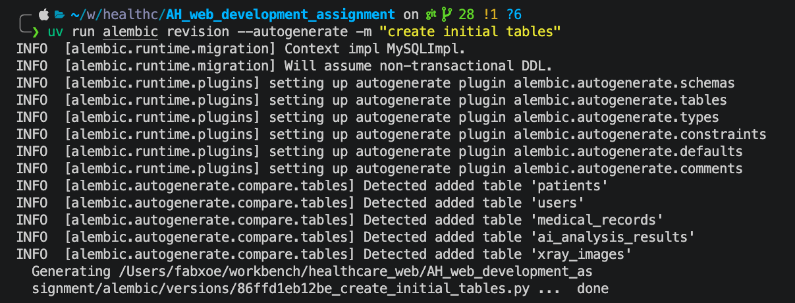
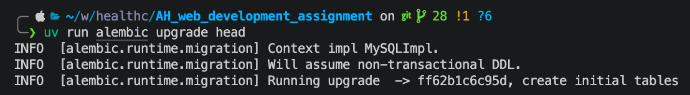
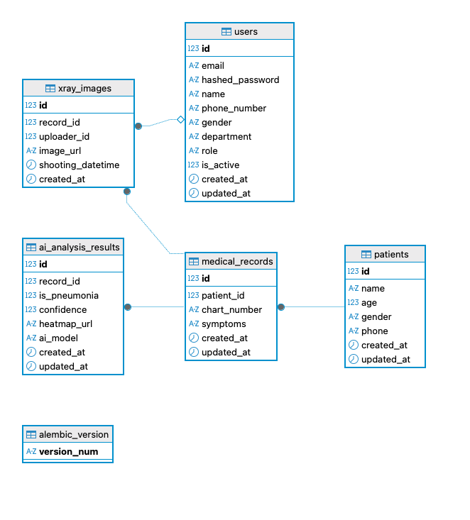
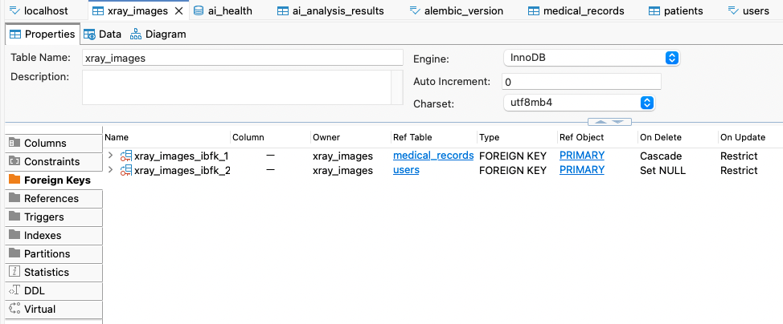

# 3일차 DB Migration 결과 정리

## 1. 실습 목표

ERD를 기준으로 SQLAlchemy ORM 모델을 작성하고, Alembic을 사용해 MySQL 데이터베이스에 스키마를 적용하였다. 이후 DBeaver에서 생성된 테이블과 외래키 관계를 확인하였다.

## 2. 사용 도구

```text
Database: MySQL
ORM: SQLAlchemy
Migration: Alembic
DB Viewer: DBeaver
Package Manager: uv
```

## 3. 작성한 테이블

### SQLAlchemy가 사용하는 관계 설정
| 테이블(모델) | 수정 사항 | 이유 |
| :--- | :--- | :--- |
| **`AIAnalysisResult`** | `xray_image_id` 제거 | 설계도와 관계 일치 및 종속성 해소 |
| **`MedicalRecord`** | `doctor_id` 필드 제거 | 참고 설계도 구조와 동일하게 맞춤 |
| **`XrayImage`** | `uploader_id` 추가 | 사진 업로더 추적성 확보 (User 관계 연결) |
| **`User`** | `uploaded_xrays` 관계 추가 | 사진 업로드 기록 조회 가능하도록 설정 |


ORM 작성을 통해서 이번 마이그레이션에서 생성한 테이블은 다음과 같다.

```text
users
patients
medical_records
xray_images
ai_analysis_results
alembic_version
```


`alembic_version` 테이블은 Alembic이 현재 DB에 적용된 migration revision을 관리하기 위해 자동으로 생성하는 테이블이다.

## 4. Alembic Revision 생성

아래 명령어로 SQLAlchemy 모델과 실제 DB 상태를 비교하여 migration 파일을 생성하였다.

```bash
uv run alembic revision --autogenerate -m "create initial tables"
```

실행 결과 Alembic이 추가된 테이블을 감지하였다.

```text
Detected added table 'patients'
Detected added table 'users'
Detected added table 'medical_records'
Detected added table 'ai_analysis_results'
Detected added table 'xray_images'
Generating ... create_initial_tables.py ... done
```



## 5. Alembic Upgrade 적용

생성된 migration 파일을 실제 MySQL 데이터베이스에 적용하였다.

```bash
uv run alembic upgrade head
```

실행 결과:

```text
Running upgrade  -> ff62b1c6c95d, create initial tables
```



## 6. DBeaver 테이블 생성 확인

DBeaver에서 `ai_health` 데이터베이스에 접속하여 테이블이 생성된 것을 확인하였다.

확인된 테이블:

```text
users
patients
medical_records
xray_images
ai_analysis_results
alembic_version
```



## 7. 외래키 관계 확인

DBeaver의 Foreign Keys 탭에서 `xray_images` 테이블의 외래키 관계를 확인하였다.

확인된 관계:

```text
xray_images.record_id
→ medical_records.id
→ ON DELETE CASCADE

xray_images.uploader_id
→ users.id
→ ON DELETE SET NULL
```

`record_id`는 특정 X-ray 이미지가 어떤 진료 기록에 속하는지 나타낸다. 따라서 진료 기록이 삭제되면 해당 X-ray 이미지도 함께 삭제되도록 `CASCADE`를 적용하였다.

`uploader_id`는 X-ray 이미지를 업로드한 사용자를 의미한다. 사용자가 삭제되어도 이미지 기록 자체는 남아야 하므로, 외래키 값만 `NULL`로 변경되도록 `SET NULL`을 적용하였다.



## 8. 정리

SQLAlchemy ORM 모델을 기반으로 Alembic migration 파일을 생성했고, `upgrade head`를 통해 MySQL 데이터베이스에 스키마를 적용하였다. DBeaver에서 테이블 생성 여부와 외래키 관계를 확인한 결과, ERD의 주요 테이블과 관계가 정상적으로 반영된 것을 확인하였다.
