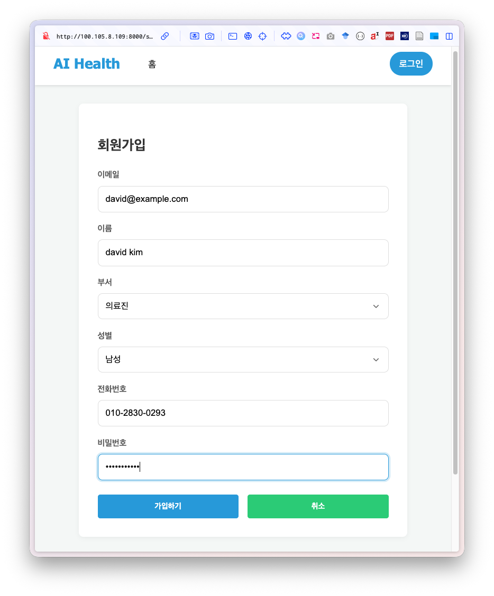
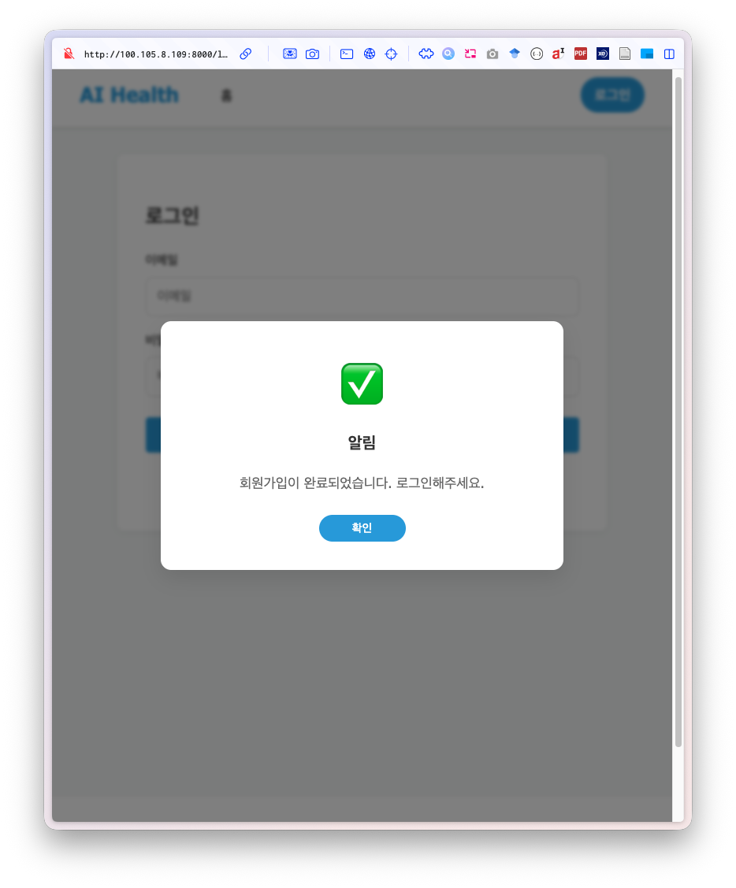
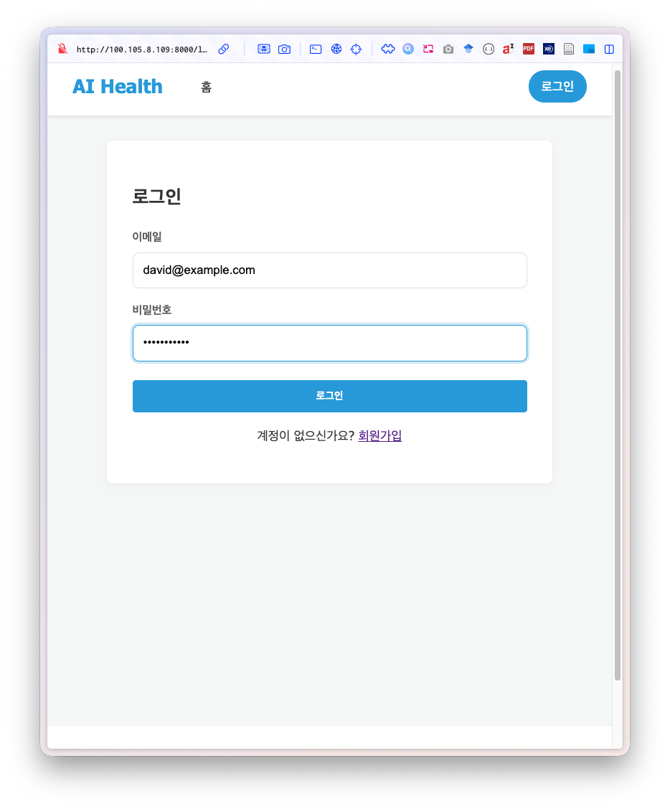
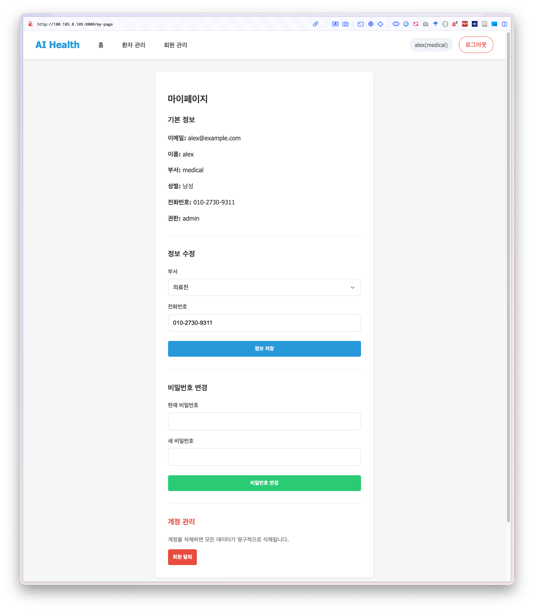
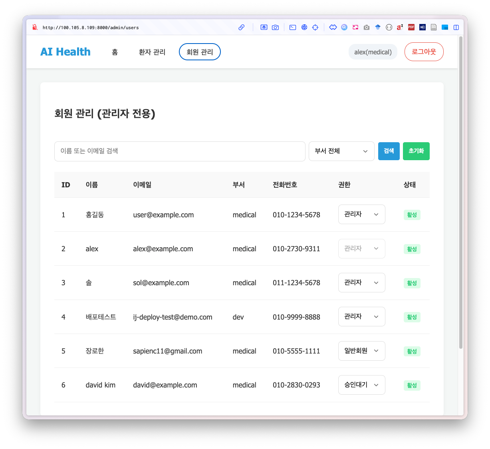
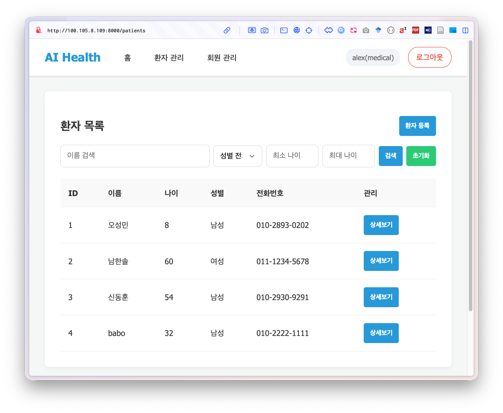
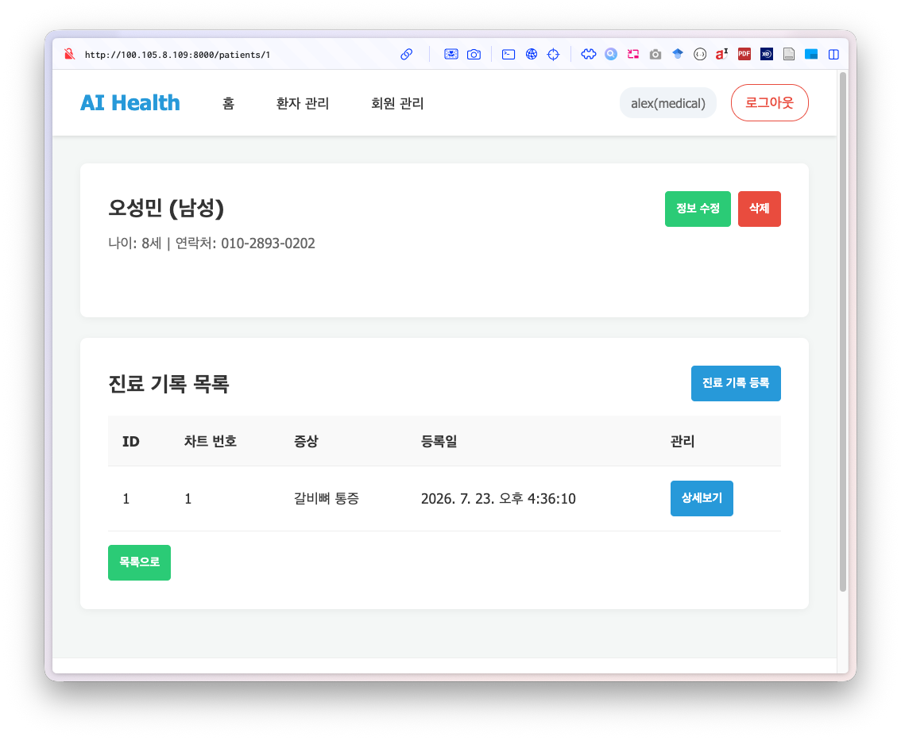
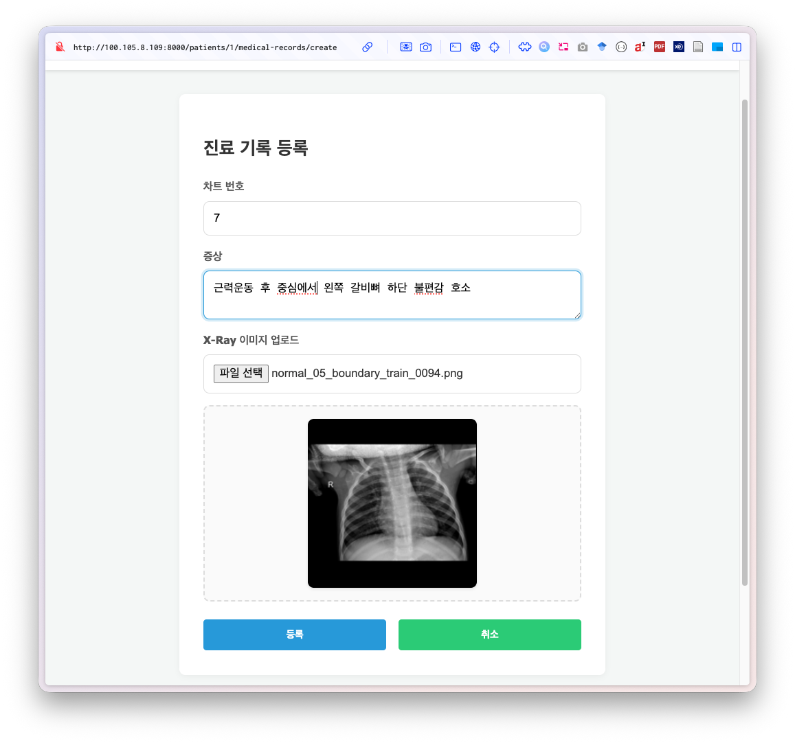
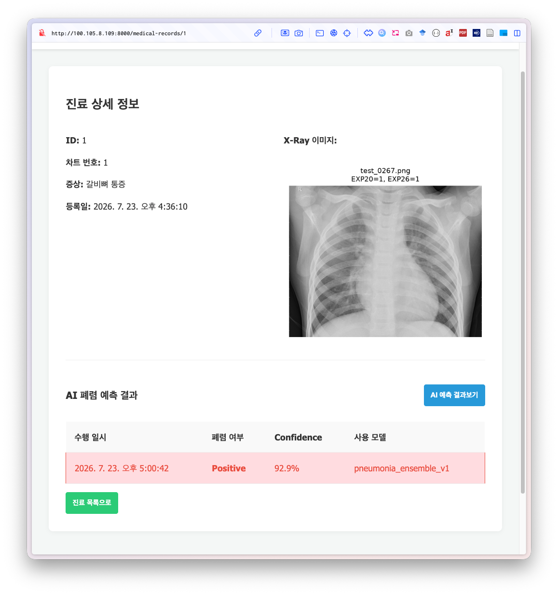
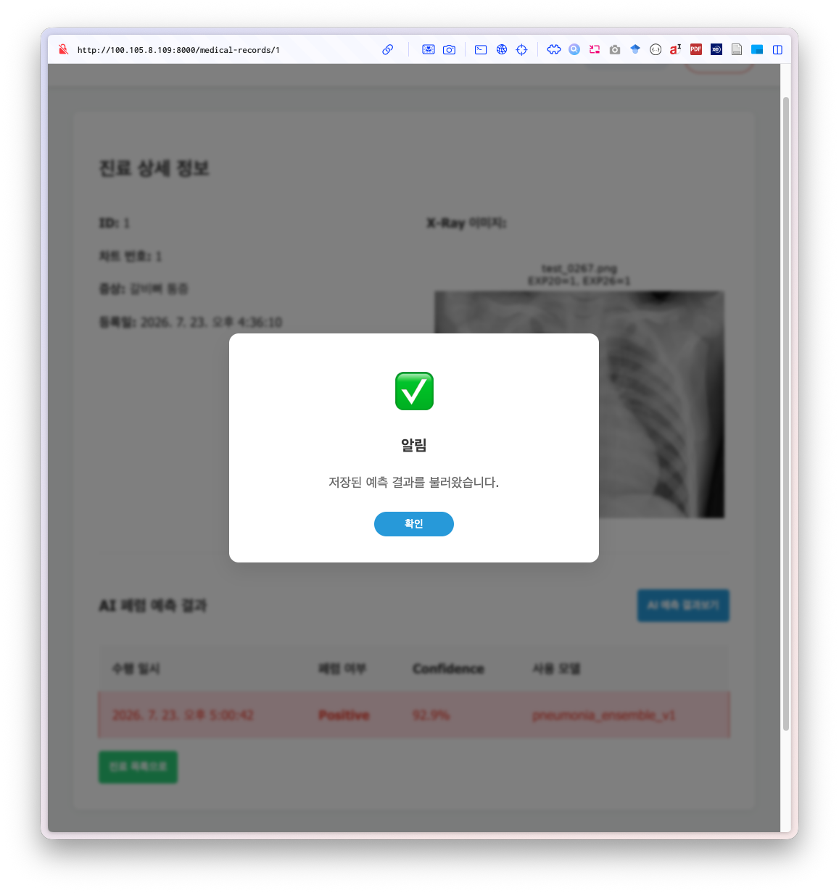

# 7일차 - 프론트엔드 연결 및 앱 실행 화면

작성자: 권일준
관련 Stage: Stage 7 (프론트 템플릿 ↔ API 연결)

---

## 0. 개요

`static/` 의 프론트엔드 템플릿을 우리 팀의 API 구현에 맞게 연결했다.
운영진 템플릿은 예측을 **동기 방식**으로 가정했으나, 우리 6일차 구현은
추론 시간(3~5초) 때문에 **비동기(202 + 폴링)** 로 설계되어 있어 이 부분을 맞췄다.

### 수정한 파일

| 파일 | 변경 내용 |
|---|---|
| `static/apis.js` | 예측 API 경로 수정, 폴링 함수(`getPredictionJob`) 추가 |
| `static/pages.js` | `handlePredict` 폴링 방식으로, 결과 목록 응답 형태·confidence 표시 수정 |

### 템플릿과 우리 API의 불일치 (수정 내역)

| 항목 | 템플릿 (수정 전) | 우리 API (수정 후) |
|---|---|---|
| 예측 요청 경로 | `POST /medical-records/{id}/predict` | `POST /medical-records/{id}/predictions` |
| 결과 목록 경로 | `GET /medical-records/{id}/analyses` | `GET /medical-records/{id}/predictions` |
| 예측 방식 | 동기 (호출 → 즉시 완료) | 비동기 (202 → 1초 간격 폴링) |
| 목록 응답 | 배열 직접 | `{ record_id, xray_image_url, predictions: [...] }` |
| confidence | `98%` 로 가정 | `0.98` 소수 → 화면에서 ×100 |

---

## 1. 실행 방법

```bash
# 1. 의존성 (API 서버에 redis 추가됨)
uv add redis

# 2. 전체 컨테이너 기동 (fastapi + mysql + redis + worker)
docker compose up -d --build

# 3. DB 마이그레이션
docker compose exec fastapi alembic upgrade head

# 4. worker 모델 로딩 확인 (약 609MB, "모델 로딩 완료" 로그가 뜰 때까지 대기)
docker compose logs -f worker

# 5. 접속
#    http://0.0.0.0:8000/
```

> 참고: `fastapi run app/main.py` 로 API 서버만 단독 실행할 수도 있으나,
> 폐렴 예측은 redis·worker 컨테이너가 함께 떠 있어야 동작한다.

---

## 2. 엔드포인트별 동작 화면

### 2-1. 회원가입 — `POST /api/v1/users/signup`

홈에서 "로그인하여 시작하기" → 회원가입 화면에서 이메일·비밀번호·이름·부서·성별·연락처 입력 후 가입.
가입 직후 role은 `pending` 이며, 관리자 승인 전에는 환자/예측 기능에 접근할 수 없다.



### 2-2. 로그인 — `POST /api/v1/users/login`

이메일·비밀번호로 로그인. 성공 시 Access Token을 받아 이후 요청 헤더에 사용한다.



### 2-3. 내 정보 — `GET/PATCH /api/v1/users/me`

마이페이지에서 내 정보 조회, 이름·연락처 수정, 비밀번호 변경, 회원 탈퇴.



### 2-4. 관리자 - 유저 관리 — `GET /api/v1/admin/users`, `PATCH /api/v1/admin/users/role`

관리자 계정으로 전체 유저 목록을 보고, `pending` 유저의 권한을 `staff` 등으로 변경.



### 2-5. 환자 등록·목록·상세·수정·삭제 — `/api/v1/patients`

- 환자 등록 (staff/admin)
- 환자 목록 조회 (이름·성별·나이 필터)
- 환자 상세 조회
- 환자 정보 수정 (이름·연락처)
- 환자 삭제 (진료기록·X-ray CASCADE 삭제)




### 2-6. 진료기록 등록·목록·상세 — `/api/v1/medical-records`

- 진료기록 등록: 차트번호·증상 입력 + X-ray 이미지 업로드
- 환자별 진료기록 목록
- 진료기록 상세 (X-ray 이미지 표시)




### 2-7. AI 폐렴 예측 — `POST /api/v1/medical-records/{id}/predictions` (핵심)

진료기록 상세 화면에서 **"AI 예측 결과보기"** 버튼을 누르면:

```
① 버튼 클릭 → 버튼이 "AI 예측 중..." 으로 바뀜 (비활성화)
② 서버가 202 + job_id 반환 (또는 캐시가 있으면 200 즉시)
③ 프론트가 1초 간격으로 작업 상태를 폴링
④ status=done 이 되면 결과 섹션에 표 갱신
   (폐렴 여부 / Confidence(%) / 사용 모델 / 수행 일시)
```

같은 진료기록을 다시 예측하면 저장된 결과를 즉시(캐시) 보여준다.


---

## 3. 연결 과정에서 배운 점

### 3-1. 프론트 템플릿은 "예시"일 뿐, API 계약이 우선이다

운영진 템플릿의 `predict`, `analyses` 경로는 우리 구현과 달랐다.
템플릿을 그대로 두고 백엔드를 맞추는 대신, **이미 설계·구현·테스트를 마친 백엔드를
기준으로 프론트를 맞췄다.** API 계약(경로·응답 형태)이 단일 기준점이기 때문이다.

### 3-2. 비동기 API는 프론트도 비동기로 받아야 한다

동기 API라면 "호출 → 완료" 한 번이면 되지만, 우리 예측 API는 202로 접수만 하고
결과는 나중에 나온다. 프론트가 이를 모르고 한 번만 호출하면 결과를 영영 못 받는다.
`setTimeout` + 반복으로 **폴링**을 구현해 완료를 감지했다.

```javascript
for (let i = 0; i < 30; i++) {          // 최대 30초
    await new Promise(r => setTimeout(r, 1000));
    const job = await apis.getPredictionJob(jobId);
    if (job.status === 'done')   { /* 결과 표시 */ break; }
    if (job.status === 'failed') { throw new Error(job.error); }
}
```

### 3-3. 숫자 단위는 프론트·백엔드가 합의해야 한다

백엔드는 confidence를 `0.9821`(소수)로 저장하는데 템플릿은 `%`로 바로 붙였다.
그대로 두면 `0.9821%` 로 표시된다. 화면에서 `(confidence * 100).toFixed(1)` 로 변환했다.

---

## 4. 검증

- `node --check` 로 `apis.js`, `pages.js` 문법 검사 통과
- 프론트 호출 경로 3개가 백엔드 OpenAPI 라우트와 정확히 일치함을 확인
  - `POST /api/v1/medical-records/{id}/predictions`
  - `GET  /api/v1/predictions/jobs/{job_id}`
  - `GET  /api/v1/medical-records/{id}/predictions`
- 응답 필드(`cached`, `job_id`, `status`, `predictions`, `is_pneumonia`, `confidence`, `ai_model`)가
  백엔드 스키마와 일치함을 확인
