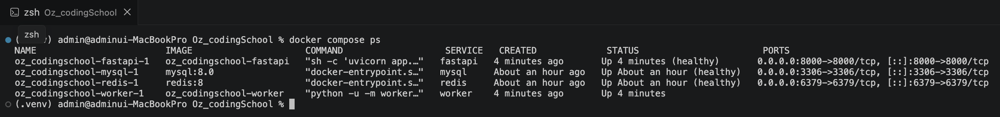
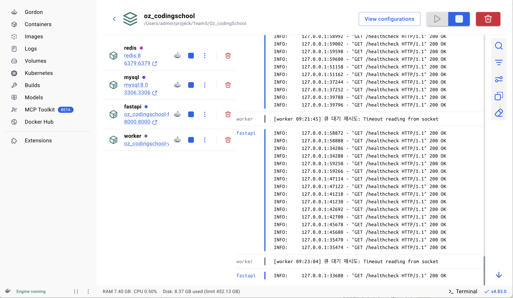

# 8일차 Docker - .dockerignore 보완 및 실행 확인

## 1. 작업 내용

`app/Dockerfile`, `docker-compose.yml`은 6~7일차(폐렴 예측 기능) 작업에서 이미 dev에 반영되어 있어, 이번 작업은 `.dockerignore` 보완에 집중했다.

### 1.1 기존 `.dockerignore`에 있던 것

- 모델 파일 (`worker/models/`)
- 파이썬 캐시 (`.venv/`, `__pycache__/`, `*.pyc`, `*.pyo`)
- Git (`.git/`, `.gitignore`)
- 환경변수 (`.env`)
- 업로드 파일 (`media/`)
- 문서·에디터 (`docs/`, `.vscode/`, `.idea/`, `.DS_Store`)

### 1.2 이번에 추가한 것

| 항목 | 추가한 규칙 | 목적 |
| --- | --- | --- |
| 라이브러리 캐시 | `.mypy_cache/`, `.pytest_cache/`, `.ruff_cache/` | 타입체커/테스트/린터 캐시가 이미지에 포함되지 않도록 |
| 도커 설정 파일 자체 | `Dockerfile`, `docker-compose.yml`, `.dockerignore` | 빌드 컨텍스트 안에서 이 파일들 자체는 컨테이너 실행에 불필요 |
| README | `README.md` | 문서 파일은 이미지에 포함할 필요 없음 |
| 환경파일 전체 | `.env.*` | 기존엔 `.env`만 있어서 `.env.local`, `.env.production` 같은 변형은 안 걸러졌음. 패턴으로 일괄 커버 |

## 2. 실행 확인

`docker compose up -d --build`로 `.dockerignore` 변경사항을 반영해 재빌드 후 실행했다.

```bash
docker compose up -d --build
docker compose ps
```

결과: `fastapi`, `mysql`, `redis`, `worker` 4개 컨테이너 모두 `Up` 상태로 정상 기동을 확인했다.



| SERVICE | STATUS |
| --- | --- |
| fastapi | Up (healthy) |
| mysql | Up (healthy) |
| redis | Up (healthy) |
| worker | Up |

Docker Desktop 화면에서도 `redis`, `mysql`, `fastapi`, `worker` 4개 컨테이너가 모두 실행 중(초록 점)인 것을 확인했다. `fastapi`, `worker` 로그에 각각 healthcheck 200 응답과 큐 폴링 로그가 정상적으로 찍히고 있다.


