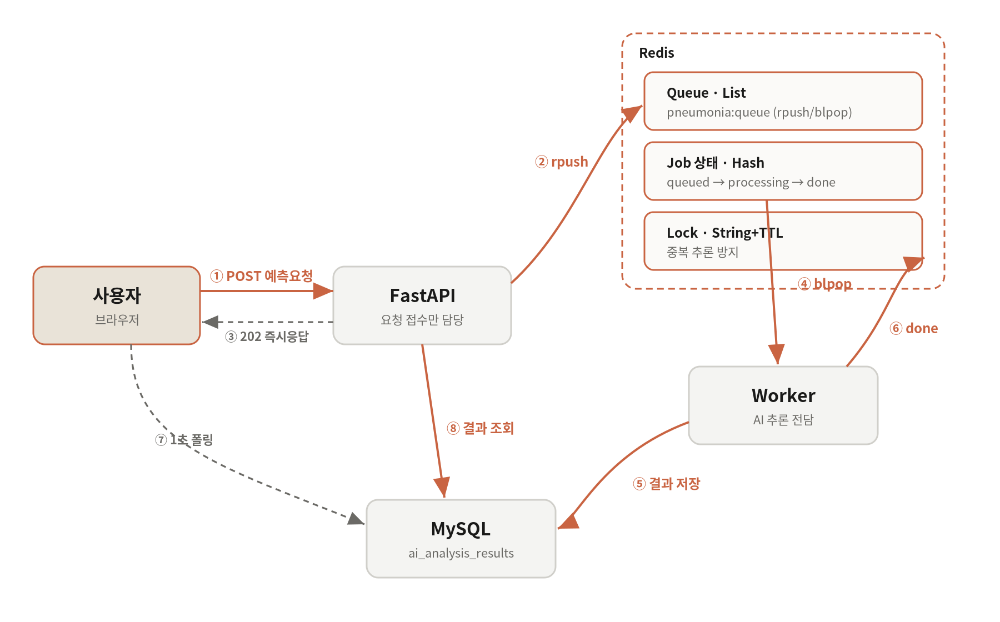

# 9일차 - 동시성 문제 해결을 위한 Event-Driven Architecture 설계

작성자: 권일준

관련 Stage: Stage 2 (FastAPI + Redis 기반 Event-Driven Architecture)

---

## 0. 개요

AI 폐렴 예측 기능은 요청 한 건을 처리하는 데 3~5초가 걸린다. 이 작업을 API가 직접 수행하면 두 가지 문제가 생긴다. 첫째, 요청을 보낸 사용자가 추론이 끝날 때까지 화면 앞에서 기다려야 한다. 둘째, 여러 사용자가 동시에 예측을 요청하면 하나의 무거운 AI 모델에 동시 접근이 몰려 서버 자원이 고갈되거나 내부 상태가 꼬인다.

이 문서는 위 문제를 **Event-Driven Architecture(EDA)** 로 해결한 설계를 정리한다. 핵심은 "요청을 받는 일"과 "무거운 추론을 실제로 수행하는 일"을 **서로 다른 프로세스로 분리**하고, 그 사이를 **Redis 큐**로 연결하는 것이다.

---

## 1. 해결하려는 동시성 문제

동기(synchronous) 방식으로 API가 추론까지 직접 처리하면 다음이 발생한다.

첫째, **응답 지연**이다. FastAPI는 비동기 서버지만, AI 추론은 CPU를 오래 점유하는 블로킹 작업이라 그 요청을 처리하는 동안 워커가 묶인다. 사용자는 3~5초간 로딩 화면을 봐야 하고, 그동안 해당 워커는 다른 요청을 받지 못한다.

둘째, **모델 동시 접근**이다. 폐렴 예측 모델은 약 609MB로 무겁고, 여러 요청이 동시에 같은 모델 객체에 접근하면 메모리 급증과 예측 불안정을 유발할 수 있다.

셋째, **중복 요청**이다. 사용자가 "AI 예측" 버튼을 연타하거나 새로고침하면 같은 진료기록에 대해 동일한 추론이 여러 번 실행되어 자원을 낭비한다.

---

## 2. 아키텍처 구성 요소

설계는 네 개의 독립 컨테이너로 구성되며, 각자의 책임이 명확히 나뉜다.

**FastAPI (API 서버)** — 사용자 요청을 받는다. 추론은 직접 하지 않고, 작업을 Redis 큐에 넣은 뒤 즉시 응답한다. 사용자가 결과를 조회할 때는 저장된 상태만 읽어 반환한다.

**Redis (메시지 브로커 겸 상태 저장소)** — 세 가지 역할을 한다. ① 처리할 작업을 담는 **대기열(Queue)**, ② 각 작업의 진행 상태를 담는 **작업 상태 저장소**, ③ 같은 진료기록의 중복 처리를 막는 **락(Lock)**.

**Worker (AI 추론 전담 프로세스)** — 큐에서 작업을 하나씩 꺼내 실제 모델 추론을 수행하고, 결과를 DB에 저장한 뒤 작업 상태를 갱신한다. 모델은 이 프로세스만 소유하므로 동시 접근으로 인한 문제가 원천 차단된다.

**MySQL (영속 저장소)** — 진료기록, X-ray 이미지, 예측 결과(`ai_analysis_results`)를 저장한다.

> 핵심 분리 원칙: **FastAPI는 "접수"만, Worker는 "처리"만** 담당한다. 둘은 코드도 컨테이너도 분리돼 있고, 오직 Redis를 통해서만 소통한다.

---

## 3. 전체 처리 흐름 (Event-Driven)

예측 요청 한 건이 처리되는 과정은 다음과 같다.

**① 요청 접수 (FastAPI)** — 사용자가 `POST /api/v1/medical-records/{record_id}/predictions` 를 호출한다. FastAPI는 진료기록·이미지 존재를 확인하고, 이미 저장된 결과가 있으면 추론 없이 즉시 반환한다(캐시). 없으면 다음 단계로 간다.

**② 중복 확인 및 작업 등록 (FastAPI → Redis)** — 같은 진료기록이 이미 처리 중인지 **락**으로 확인한다. 처리 중이면 기존 `job_id`를 그대로 알려준다. 새 작업이면 `job_id`를 발급하고, 작업 상태를 `queued`로 기록한 뒤 **큐에 작업을 넣는다(`rpush`)**.

**③ 즉시 응답 (FastAPI → 사용자)** — 추론을 기다리지 않고 **`202 Accepted`** 와 `job_id`, 폴링 주소를 반환한다. 사용자는 여기서 즉시 자유로워진다.

**④ 작업 소비 및 추론 (Worker)** — Worker는 큐를 **블로킹 방식으로 대기(`blpop`)** 하다가 작업이 들어오면 꺼낸다. 상태를 `processing`으로 바꾸고, 이미지를 불러와 모델 추론을 수행한 뒤 결과를 `ai_analysis_results`에 저장한다. 마지막으로 상태를 `done`(+ `result_id`)으로 갱신하고 락을 해제한다.

**⑤ 결과 조회 (사용자 → FastAPI)** — 프론트는 `GET /api/v1/predictions/jobs/{job_id}` 를 1초 간격으로 **폴링**한다. 상태가 `done`이 되면 FastAPI가 DB에서 저장된 결과를 읽어 함께 반환하고, 프론트가 화면을 갱신한다.

---

## 4. Redis 자료구조 활용

Redis의 세 가지 쓰임을 자료구조 단위로 정리하면 다음과 같다.

**작업 대기열 — List (`pneumonia:queue`)**
API는 `rpush`로 오른쪽에 작업을 넣고, Worker는 `blpop`으로 왼쪽에서 꺼낸다. 넣는 쪽과 꺼내는 쪽이 반대라 **FIFO(선입선출)** 가 보장된다. `blpop`은 큐가 빌 때까지 블로킹하므로 Worker가 불필요하게 CPU를 돌리며 폴링하지 않는다. Worker를 여러 개 띄우면(`--scale worker=N`) 각 워커가 큐에서 서로 다른 작업을 나눠 가져가 **수평 확장**이 된다.

**작업 상태 — Hash (`pneumonia:job:{job_id}`)**
각 작업의 `status`(queued → processing → done/failed), `record_id`, `result_id`, `error` 등을 하나의 해시에 담는다. TTL 1시간을 걸어 오래된 작업 상태가 자동으로 정리되게 했다.

**중복 방지 락 — String + TTL (`pneumonia:lock:{record_id}`)**
새 작업 등록 시 진료기록 id로 락을 건다(`set ... ex=600`). 이미 락이 있으면 처리 중으로 보고 기존 작업을 알려준다. Worker가 작업을 끝내면 락을 지운다. TTL 10분을 둔 이유는, 혹시 Worker가 도중에 죽어 락을 못 지워도 일정 시간 뒤 자동 해제되어 영구 잠김을 막기 위함이다.

---

## 5. 이 설계가 동시성 문제를 해결하는 방식

**응답 지연 해결** — API는 큐에 작업만 넣고 곧바로 `202`로 응답한다. 추론 시간(3~5초)이 사용자 응답 시간과 완전히 분리되어, 사용자는 기다리지 않는다.

**모델 동시 접근 해결** — 추론은 오직 Worker 프로세스에서만 일어난다. 워커가 큐에서 한 번에 하나씩 꺼내 순차 처리하므로, 무거운 모델에 동시 접근이 몰리는 상황 자체가 생기지 않는다. 처리량이 필요하면 워커 프로세스 수를 늘려 조절한다.

**중복 요청 해결** — 진료기록 단위 락으로, 같은 기록에 대한 추론이 한 번만 실행되도록 보장한다. 버튼 연타·새로고침에도 중복 추론이 발생하지 않는다.

**장애 격리** — 한 작업이 실패해도 Worker는 죽지 않고 상태를 `failed`로 기록한 뒤 다음 작업을 계속 처리한다. API 서버와 Worker가 분리돼 있어, 추론 부하나 오류가 API의 응답성에 영향을 주지 않는다.

---

## 6. 아키텍처 다이어그램

아래는 폐렴 예측 요청이 처리되는 Event-Driven Architecture 흐름을 도식화한 것이다. FastAPI(접수)와 Worker(추론)가 좌우로 분리돼 있고, 그 사이를 Redis(큐·작업상태·락)가 잇는다.

---

## 7. 참고자료

- How to Use Redis Streams with FastAPI for Event Processing (oneuptime.com)
- [FastAPI] Celery로 AI Task 비동기 처리하기 (velog.io/@nickygod)
- Mastering Background Job Queues with Celery, Redis, and FastAPI (python.plainenglish.io)

> 참고자료는 Celery를 사용하지만, 본 프로젝트는 동일한 Event-Driven 원리를 **Redis List(큐) + 전용 Worker 프로세스** 로 직접 구현했다. Celery라는 프레임워크 대신 최소 구성으로 같은 목적(작업 분리·비동기 처리·큐 관리)을 달성한 것이 특징이다.
