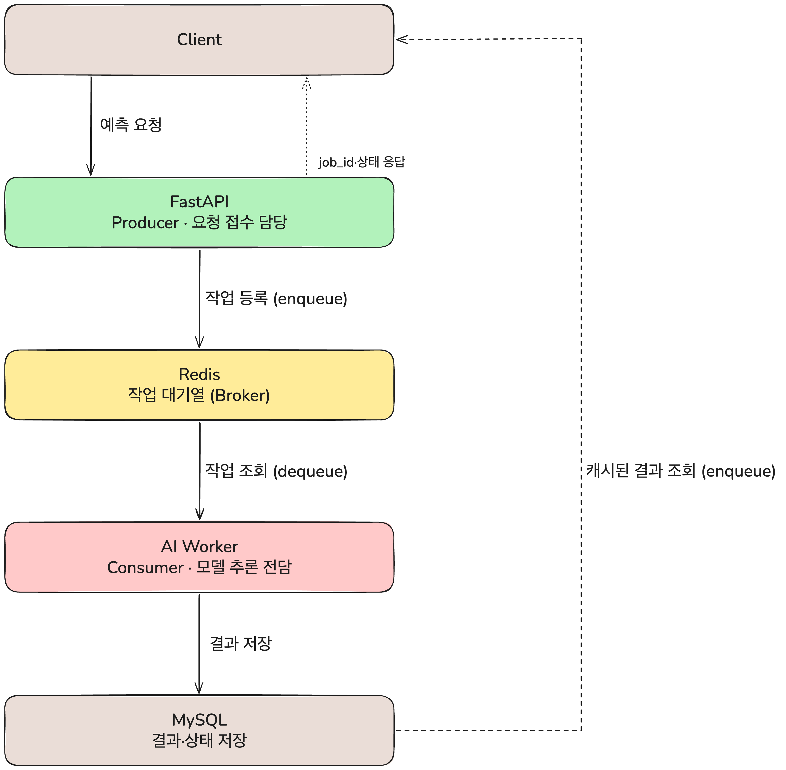

# 9일차 동시성 문제 해결을 위한 아키텍처 설계

## 1. 왜 이 아키텍처가 필요한가 — 동시성 문제의 정체

우리 프로젝트의 폐렴 예측 기능은 다음 제약을 동시에 만족해야 한다.

- **NFR-PRED-002**: 모든 API는 3초 이내에 응답해야 한다.
- 실제 AI 추론(ConvNeXt-Tiny 5-fold + EfficientNet-B0 5-fold 앙상블)은 CPU 기준 **3.6~5초**가 걸린다.

즉 "요청을 받고 → 추론하고 → 응답한다"를 하나의 요청-응답 사이클 안에서 순서대로 처리하면, 추론 시간만으로 이미 3초 기준을 넘긴다. 게다가 FastAPI 하나의 이벤트 루프가 무거운 추론 작업을 직접 수행하면, 그동안 다른 사용자의 요청(로그인, 환자 조회 등)까지 같이 지연되는 **동시성 문제**가 생긴다.

이걸 해결하는 방법이 **"무거운 작업을 API 서버에서 분리해서, 별도 프로세스가 처리하게 하는 것"**이고, 이때 API 서버(생산자)와 처리 프로세스(소비자) 사이를 이어주는 매개체로 Redis를 큐로 활용하는 것이 이번 학습 주제다.

## 2. Event-Driven Architecture란

이벤트 기반 아키텍처는 컴포넌트끼리 직접 함수를 호출하는 대신, **"이런 일이 일어났다"는 이벤트를 큐/스트림에 발행(publish)하고, 그걸 구독(subscribe)하는 쪽이 각자의 속도로 처리**하는 구조다.

- **생산자(Producer)**: 이벤트를 발생시키는 쪽. 우리 프로젝트에서는 FastAPI가 "예측 요청이 들어왔다"는 이벤트를 큐에 넣는 역할.
- **큐/브로커(Broker)**: 이벤트를 임시로 보관하는 곳. 여기서는 Redis.
- **소비자(Consumer)**: 큐에서 이벤트를 꺼내 실제 작업을 수행하는 쪽. 우리 프로젝트의 `worker` 프로세스.

이 구조의 핵심 이점은 **생산자와 소비자가 서로의 처리 속도를 기다리지 않는다**는 점이다. FastAPI는 큐에 작업을 넣기만 하고 바로 응답하면 되므로, 추론에 몇 초가 걸리든 API 응답 속도와는 무관해진다.

## 3. Redis를 큐로 쓰는 두 가지 방식 비교

참고 자료를 조사하면서, Redis로 작업 큐를 구현하는 방식이 크게 두 갈래로 나뉜다는 걸 확인했다.

### 3.1 Redis Streams (`XADD` / `XREADGROUP`)

Redis 5.0부터 지원하는 자료구조로, 각 이벤트가 순서를 보장하는 로그에 추가된다. Consumer Group을 만들면 여러 worker가 메시지를 나눠 가져갈 수 있고, `XACK`으로 처리 완료를 명시적으로 확인해야 한다. 처리 도중 worker가 죽어서 확인(ack) 못 한 메시지는 `XAUTOCLAIM`으로 다른 worker가 대신 가져가 재처리할 수 있다.

```python
# 생산자: 이벤트 발행
await redis.xadd("orders", {"order_id": order_id, "status": "pending"})

# 소비자: 그룹으로 읽고, 처리 후 명시적으로 ack
messages = await redis.xreadgroup(
    groupname="order-processors", consumername="worker-1",
    streams={"orders": ">"}, count=10, block=5000,
)
await redis.xack("orders", "order-processors", msg_id)
```

**장점**: 메시지가 유실되지 않는다(at-least-once delivery), 여러 worker로 수평 확장이 쉽다, 별도 큐 관리 시스템 없이 Redis 하나로 해결된다.

### 3.2 Celery + Redis (브로커로 사용)

Celery는 파이썬의 대표적인 분산 작업 큐 프레임워크로, Redis나 RabbitMQ를 메시지 브로커로 붙여 쓴다. `@app.task`로 함수를 태스크로 등록해두면, FastAPI는 `task.delay()`로 작업을 큐에 넣기만 하고, 별도 Celery worker 프로세스가 그 태스크를 실행한다. 재시도(retry), 스케줄링, 결과 저장(result backend) 같은 기능이 프레임워크 차원에서 이미 갖춰져 있다.

**장점**: 재시도·타임아웃·주기적 작업 같은 운영 기능이 이미 만들어져 있어 직접 구현할 필요가 없다.
**단점**: Celery 자체의 설정(브로커, 백엔드, worker 실행 방식)을 새로 배워야 하고, 우리 프로젝트처럼 "예측 작업 하나"만 처리하는 단순한 큐에는 다소 무거운 선택일 수 있다.

### 3.3 우리 프로젝트가 선택한 방식

우리 프로젝트는 Redis Streams나 Celery 같은 프레임워크를 직접 쓰는 대신, **Redis를 단순 작업 큐(List 자료구조 기반)로 쓰는 경량 구조**를 채택했다. 이유는:

- 처리해야 하는 작업 종류가 "폐렴 예측" 하나뿐이라, Celery의 태스크 라우팅·스케줄링 기능이 필요 없다.
- Consumer Group 기반의 복잡한 재처리 로직 없이도, worker 프로세스 1개가 순차적으로 큐를 폴링하는 것으로 충분하다.
- `docker-compose.yml`에 `redis` 컨테이너 하나만 추가하면 되어, 인프라 구성이 단순하다.

## 4. 우리 프로젝트에 실제로 적용된 아키텍처

로컬 Docker 환경(`docker compose up`)에서 실제로 이 흐름을 실행하고 검증했다.

```
1. 클라이언트 → FastAPI: POST /medical-records/{record_id}/predictions
2. FastAPI → DB: 이미 같은 모델로 예측한 결과가 있는지 확인
   ├─ 있으면 → 클라이언트에게 200 + 결과 즉시 반환 (재추론 안 함)
   └─ 없으면 → 아래로 진행
3. FastAPI → Redis: 예측 작업을 큐에 등록 (job_id 발급)
4. FastAPI → 클라이언트: 202 Accepted + job_id (3초 이내 응답 완료, 여기서 요청-응답 사이클 종료)
5. Worker → Redis: 큐를 지속적으로 폴링하며 새 작업 감지
6. Worker: X-ray 이미지를 읽어 AI 모델(ConvNeXt-Tiny + EfficientNet-B0 앙상블)로 추론 (3.6~5초)
7. Worker → DB: 예측 결과 저장
8. 클라이언트 → FastAPI: GET /predictions/jobs/{job_id} (폴링, 몇 초 간격 반복)
9. FastAPI → 클라이언트: 작업 상태(queued → processing → done) 및 완료 시 결과 반환
```

핵심은 **3번과 6번이 서로 다른 프로세스(컨테이너)에서 일어난다**는 점이다. FastAPI 컨테이너는 무거운 추론을 전혀 수행하지 않고, 오직 큐에 작업을 넣고 상태를 조회하는 가벼운 역할만 한다. 모델(약 609MB)은 worker 컨테이너에만 로드되어 있으며, 시작 시 한 번만 메모리에 올라간다.

## 5. 아키텍처 다이어그램

FastAPI(API 서버)와 AI Worker(추론 전담 프로세스)가 Redis 큐를 통해서만 연결되고, 서로 직접 호출하지 않는 구조를 도식화했다.



다이어그램 구성 요소:

- **Client**: 웹 브라우저. 예측 요청을 보내고, `job_id`로 결과를 폴링한다.
- **FastAPI (Producer)**: 요청을 받아 캐시를 확인하고, 없으면 Redis 큐에 작업을 등록한 뒤 즉시 응답한다. 추론 로직을 전혀 갖고 있지 않다.
- **Redis (Broker)**: 작업 대기열. FastAPI와 Worker 사이의 유일한 접점이다.
- **AI Worker (Consumer)**: Redis 큐를 폴링하며, 새 작업이 있으면 X-ray 이미지를 읽어 모델로 추론하고 결과를 DB에 저장한다.
- **MySQL**: 예측 결과와 작업 상태가 최종적으로 저장되는 곳.

## 6. 참고 자료

- [How to Use Redis Streams with FastAPI for Event Processing](https://oneuptime.com/blog/post/2026-03-31-redis-fastapi-streams-event-processing/view) — Redis Streams의 Consumer Group, XADD/XREADGROUP/XACK, 장애 시 XAUTOCLAIM을 통한 재처리 방식을 정리.
- [FastAPI - Celery로 AI Task 비동기 처리하기](https://velog.io/@nickygod/FastAPI-Celery로-AI-Task-비동기-처리하기) — FastAPI에서 무거운 AI 작업을 Celery task로 위임하고, 클라이언트가 task 상태를 폴링하는 패턴을 정리.
- [Mastering Background Job Queues with Celery, Redis, and FastAPI](https://python.plainenglish.io/mastering-background-job-queues-with-celery-redis-and-fastapi-9eabb97c38af) — Celery worker 구성과 Redis를 브로커/결과 백엔드로 함께 쓰는 설정 방법을 정리.
- 팀 정리 자료: [FastAPI와 Redis 기반의 Event-Driven Architecture 설계](https://app.notion.com/p/e71caf5650aa82dfacf481091dfdedcd?source=copy_link)
