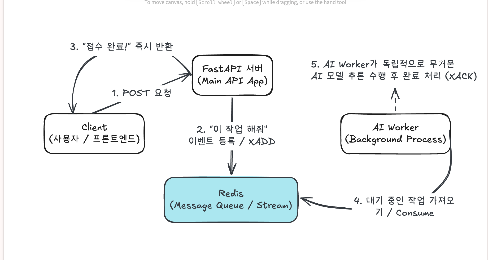

# 🚀 Stage 2: 동시성 문제 해결을 위한 Event-Driven Architecture (EDA) 설계 가이드

---

## 1. 개요 및 도입 배경: 왜 전통적인 방식은 한계에 부딪힐까?

웹 서비스를 개발하고 운영하다 보면 **AI 모델 서빙(추론), 대용량 파일 다운로드, 이미지/음성 데이터 분석, 대량 메일 발송** 등 서버에 엄청난 부하를 주고 처리 시간이 오래 걸리는 작업(Task)들을 마주하게 됩니다.

만약 사용자가 요청을 보냈을 때 서버가 모든 무거운 연산을 끝낼 때까지 화면을 멈춘 채 기다리게 만드는 **동기(Synchronous) 방식**을 사용하면 어떤 일이 벌어질까요?
* **사용자 경험(UX) 저하**: 로딩 바만 빙글빙글 돌며 사용자가 서비스를 이탈하게 됩니다.
* **동시성 문제(Concurrency Issue) 및 서버 다운**: 여러 명의 사용자가 동시에 무거운 요청을 보낼 경우, 서버의 자원(CPU, Memory)이 한계에 다달아 요청이 씹히거나 서버 자체가 뻗어버리는 치명적인 병목 현상이 발생합니다.

이러한 문제를 해결하기 위해 도입하는 핵심 개념이 바로 **이벤트 중심 아키텍처(EDA, Event-Driven Architecture)**와 **백그라운드 작업 큐(Background Job Queue)** 시스템입니다.

* **이벤트 중심 아키텍처(EDA)란?**
  * 시스템 간의 통신을 '요청-응답'의 직접적인 묶음이 아니라, **"주문이 들어왔다", "AI 분석 요청이 생성되었다"와 같은 '이벤트(사건)'**를 발생시키고, 이를 필요로 하는 곳에서 비동기적으로 처리하는 아키텍처 패턴입니다.
* **백그라운드 작업 큐(Background Job Queue)란?**
  * 당장 처리하지 않아도 되는 무거운 작업들을 메인 서버가 직접 처리하지 않고, **우체통(Queue)에 순서대로 차곡차곡 줄을 세워둔 뒤 백그라운드에서 일꾼(Worker)들이 하나씩 꺼내어 처리**하도록 만드는 작업 적재 시스템입니다.

---

## 2. 비동기 처리 방식 비교: 우리 프로젝트에 맞는 최적의 도구 찾기

앞서 살펴본 백그라운드 작업 큐와 비동기 처리를 구현하는 방법은 다양합니다. 위에서 정의한 백그라운드 작업 큐 시스템을 실제로 어떤 기술로 구현하느냐에 따라 성능과 안정성이 크게 달라지므로, 대표적인 3가지 방식을 비교해 보겠습니다.

| 구현 방식 | 핵심 동작 원리 | 장점 | 치명적인 한계점 및 연관성 |
| :--- | :--- | :--- | :--- |
| **1. FastAPI BackgroundTasks** | FastAPI 내장 기능으로, 응답 반환 직후 미들웨어 레벨에서 백그라운드 실행 | 별도의 외부 인프라가 필요 없고 구현이 매우 직관적임 | • 단일 프로세스/서버 환경에서만 작동<br>• **서버가 재시작되면 진행 중이던 작업이 모두 유실됨** |
| **2. Python asyncio.create_task** | 파이썬 표준 라이브러리의 이벤트 루프를 이용해 코루틴을 즉시 스케줄링 | 작업 취소, 타임아웃 등 세밀한 비동기 제어가 가능함 | • 단일 서버 종속적<br>• 마찬가지로 서버 장애 시 작업 **데이터 유실** |
| **3. Redis & Worker (Celery/Streams)** | 독립된 외부 메시지 브로커(Redis)와 워커 프로세스를 연동하여 큐 관리 | • **완벽한 작업 지속성(Persistence) 보장**<br>• 멀티 서버/워커 환경에서 분산 처리 가능 | • Redis 및 Worker 인프라 구축 및 설정 복잡도가 높음 |

> **💡 백그라운드 작업 큐가 비동기 처리 방식과 갖는 연관성:**
> 비동기 처리는 "사용자를 기다리게 하지 않고 뒤에서 일을 처리한다"는 **개념**이고, 백그라운드 작업 큐는 그 비동기 작업을 **"어디에 어떻게 쌓고 안전하게 관리할 것인가"에 대한 구체적인 수단**입니다. 즉, 큐가 없다면 비동기 작업은 서버 메모리에만 의존하다가 서버가 꺼질 때 공중으로 사라지게 되므로, 안정적인 비동기 처리를 위해서는 반드시 작업 큐 시스템이 동반되어야 합니다.

---

## 3. Redis와 메시지 큐를 활용한 아키텍처 구조: 왜 이 구조를 설계해야 하는가?

앞서 비교한 비동기 처리 방식 중, 프로덕션 환경에서 가장 안전하고 확장성 높은 구조가 바로 **Redis와 메시지 큐(Message Queue / Stream)를 결합한 Event-Driven Architecture**입니다. 그렇다면 왜 굳이 이 복잡해 보이는 구조를 설계하고 이해해야 할까요?

그 이유는 **① 서버 장애 시 데이터 유실 방지, ② 다중 워커를 통한 부하 분산, ③ 시스템 간의 결합도 낮추기(Decoupling)**를 달성하기 위해서입니다. 참고자료인 [How to Use Redis Streams with FastAPI for Event Processing](https://oneuptime.com/blog/post/2026-03-31-redis-fastapi-streams-event-processing/view) 및 [Celery로 AI Task 비동기 처리하기](https://velog.io/@nickygod/FastAPI-Celery%EB%A1%9C-AI-Task-%EB%B9%84%EB%8F%99%EA%B8%B0-%EC%B2%98%EC%66%ac%ED%95%98%EA%B8%B0)를 바탕으로 한 전체 데이터 흐름도는 다음과 같습니다.

```text
[ Client (사용자 / 프론트엔드) ]
       │
       ▼ (1) POST /events/order (이벤트 발생 요청)
[ FastAPI 서버 (Main API) ]
       │
       ▼ (2) 무거운 작업 데이터를 Redis 우체통에 적재 (XADD / Task Send)
[ Redis (Message Broker & Queue) ] 
       │
       ├── (3) 대기 시간 없이 즉시 응답 반환 ──► [ Client ]
       │
       ▼ (4) 대기 중인 작업을 가져와 순차적 소비 (Consume / Consumer Groups)
[ Worker (백그라운드 일꾼 프로세스) ]
       │
       ▼ (5) 무겁고 긴 AI 연산/데이터 처리 수행 후 확인 처리 (XACK)
```

🔍 아키텍처 구성 요소별 상세 역할
Client (FastAPI): 사용자의 요청을 가장 최전선에서 받아, 무거운 연산을 직접 수행하지 않고 "이런 작업이 들어왔다"는 이벤트 데이터만 Redis 큐에 던진 뒤 즉시 "요청 접수 완료" 응답을 돌려줍니다. 사용자는 오랜 시간 로딩을 겪지 않아 대단히 쾌적한 경험을 하게 됩니다.

Message Broker (Redis): 클라이언트와 백그라운드 워커 사이의 안전한 중앙 우체통(메시지 브로커) 역할을 수행합니다. 데이터가 메모리에만 머무는 것이 아니라 디스크/로그 기반으로 관리되므로, 서버가 갑자기 다운되거나 재시작되어도 작업 내용이 유실되지 않고 안전하게 보존됩니다.

Worker (백그라운드 프로세스): 웹 서버와는 완전히 분리되어 백그라운드에서 상시 대기하는 독립된 일꾼입니다. Redis 큐에 쌓인 작업들을 하나씩 가져와 실제로 부하가 큰 AI 모델 추론이나 데이터 처리를 수행하고, 처리가 완료되면 완료 도장(XACK)을 찍어 큐에서 해당 작업을 안전하게 제거합니다.
---

## 4. 결론 및 기대효과
동시성 문제와 서버 병목 현상은 단순한 코드 최적화만으로는 해결하기 어렵습니다.

FastAPI와 Redis 기반의 Event-Driven Architecture를 도입함으로써, 프론트엔드 서버는 가볍고 빠르게 사용자 응답을 처리하고, 무거운 연산은 백그라운드 워커들이 안전하게 나누어 처리하는 이상적인 역할 분담 구조를 완성할 수 있습니다.

이를 통해 우리 프로젝트의 확장성과 시스템 안정성을 극대화할 수 있습니다.

---

## 5. 📊 시스템 아키텍처 도식화 (Event-Driven Architecture)

> 본 도식화는 FastAPI 웹 서버와 AI 백그라운드 워커 간의 역할 분리 및 Redis 기반 작업 대기열 흐름을 나타냅니다.



### 📌 설계 포인트
1. **역할 분리**: 사용자의 요청을 받는 `FastAPI 서버`와 무거운 AI 연산을 처리하는 `AI Worker`를 완전히 분리하여 웹 서버의 병목 현상을 방지했습니다.
2. **Redis 작업 대기열**: 폭발적인 요청이 들어와도 `Redis`가 큐(Queue) 형태로 안전하게 작업을 줄 세워 관리하므로 동시성 문제를 해결할 수 있습니다.